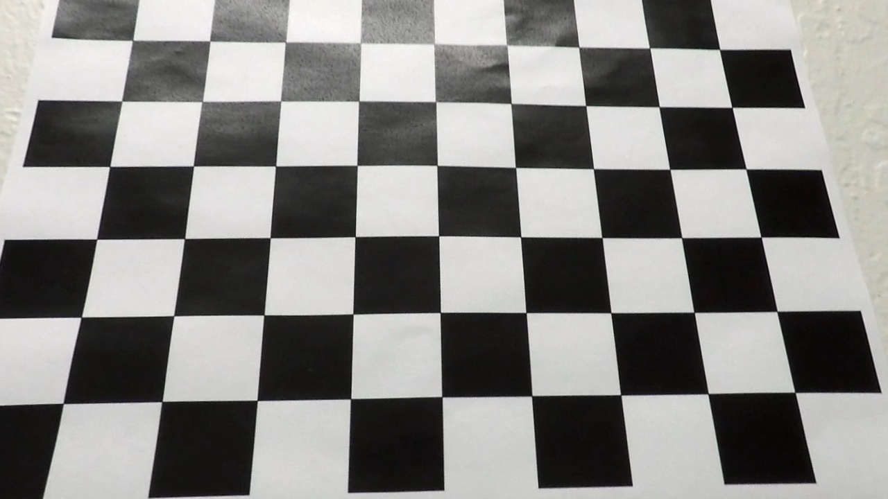
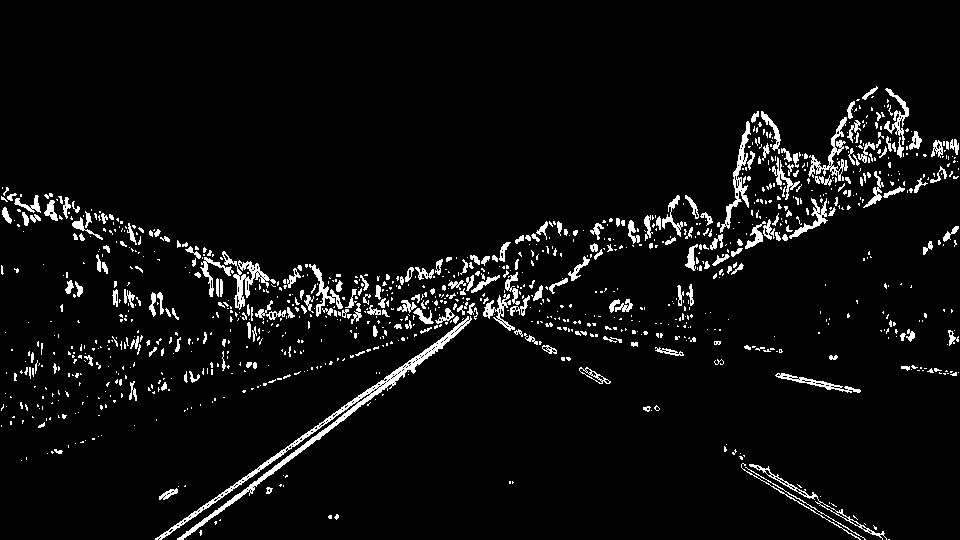
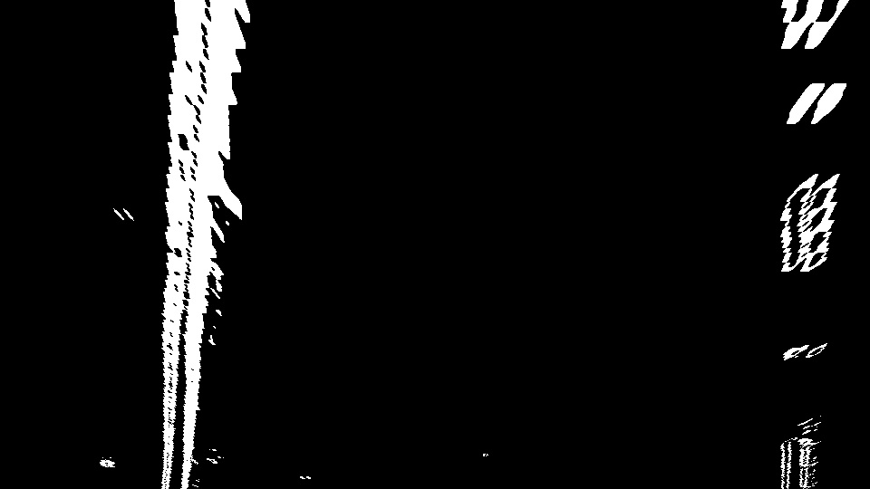
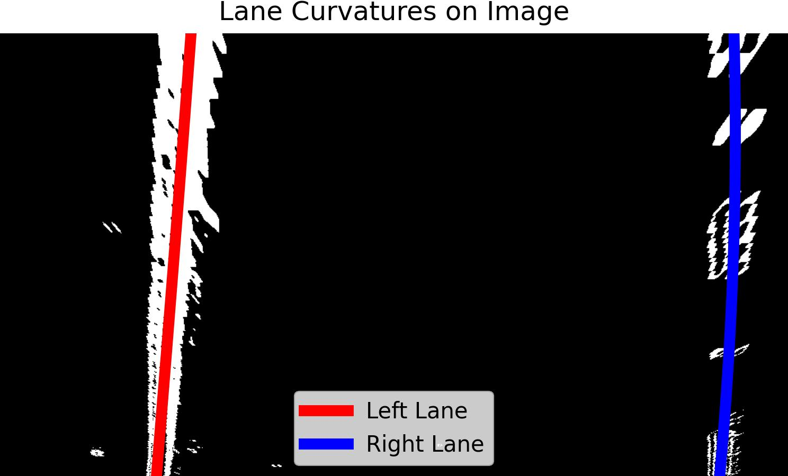

**Lane Finding Project**

The goals / steps of this project are the following:

* Compute the camera calibration matrix and distortion coefficients given a set of chessboard images.
* Apply a distortion correction to raw images.
* Use color transforms, gradients, etc., to create a thresholded binary image.
* Apply a perspective transform to rectify binary image ("birds-eye view").
* Detect lane pixels and fit to find the lane boundary.
* Determine the curvature of the lane and vehicle position with respect to center.
* Warp the detected lane boundaries back onto the original image.
* Output visual display of the lane boundaries and numerical estimation of lane curvature and vehicle position.

### Camera Calibration

In this step, the camera calibration is performed using chessboard images. Specifically:

1. **Chessboard Corners Detection:**

The findChessboardCorners function from OpenCV is used to detect the inner corners of a chessboard pattern in calibration images.
These detected corners represent the observed image points.

2. **Object Points Generation:**

A corresponding set of 3D points in the real world (assuming the chessboard lies flat on the z=0 plane) is generated. These are referred to as object points.

3. **Camera Matrix and Distortion Coefficients Calculation:**

The calibrateCamera function is used with the object points and image points. This computes the camera matrix and distortion coefficients, which correct lens distortion.

4. **Distortion Correction:**

Using the computed matrix and coefficients, images are undistorted with cv2.undistort, removing distortion and producing geometrically accurate images.


| Distorted  | Undistorted |
| ------------- | ------------- |
|    |   |

#### 2. Describe how (and identify where in your code) you used color transforms, gradients or other methods to create a thresholded binary image.  Provide an example of a binary image result.

To create a thresholded binary image, I applied a combination of grayscale conversion and gradient thresholding techniques. This process was implemented in the `create_binary_image` function, located in the `helper_functions.py` file.

1. **Grayscale Conversion**: 
   - The input image is first converted to grayscale using `cv2.cvtColor(image, cv2.COLOR_RGB2GRAY)`. This simplifies the image by removing color information, making it easier to analyze intensity gradients.

2. **Sobel Gradient Thresholding**:
   - The Sobel operator is applied in the x-direction using `cv2.Sobel(gray, cv2.CV_64F, 1, 0, ksize=3)`. This detects horizontal edges, which are essential for identifying lane lines.
   - The absolute values of the gradients are computed, and the result is scaled to an 8-bit range `[0, 255]`.
   - A binary threshold is applied: pixels with scaled gradients between 20 and 100 are set to `1`, while others are set to `0`. This highlights areas of the image with significant horizontal intensity changes.

The result is a binary image where lane lines are distinctly highlighted while the rest of the image is suppressed. An example of a binary images generated by this function can be seen in the `output/binary_*.jpg` file, created during the execution of the `main.py` script.

| Orginal  | Binary |
| ------------- | ------------- |
|    |   |

#### 3. Describe how (and identify where in your code) you performed a perspective transform and provide an example of a transformed image.

In the `perspective_transform` function, a perspective transformation was applied to convert the road's trapezoidal region in the original image into a top-down, bird's-eye view. This transformation simplifies lane detection by making the lane lines appear parallel and easier to analyze.

1. **Defining Source and Destination Points**:
   - The source (`src`) points identify the trapezoidal region in the original image that captures the lane lines.
     ```python
     src = np.float32([[175, image.shape[0]], [900, image.shape[0]], [550, 350], [425, 350]])
     ```
   - The destination (`dst`) points define a rectangular region in the bird's-eye view.
     ```python
     dst = np.float32([[200, image.shape[0]], [900, image.shape[0]], [900, 0], [200, 0]])
     ```

2. **Computing the Transformation Matrix**:
   - OpenCV's `cv2.getPerspectiveTransform` computes the transformation matrix to map the `src` points to the `dst` points.
     ```python
     matrix = cv2.getPerspectiveTransform(src, dst)
     ```

3. **Applying the Transformation**:
   - The binary image is warped using `cv2.warpPerspective` to obtain the top-down view.
     ```python
     warped = cv2.warpPerspective(binary_image, matrix, img_size)
     ```

4. **Inverse Transformation**:
   - An inverse transformation matrix is computed for projecting the detected lane lines back onto the original image.
     ```python
     inverse_matrix = cv2.getPerspectiveTransform(dst, src)
     ```

The function returns the warped binary image and the inverse matrix.
You can also set display_frame parameter to see boundaries for the transformations.

Below is an example of the result of the perspective transform, showing how the lane lines become parallel:

| Orginal  | Warped |
| ------------- | ------------- |
|    |   |


#### 4. Describe how (and identify where in your code) you identified lane-line pixels and fit their positions with a polynomial?

The identification of lane-line pixels and fitting their positions with a polynomial is handled in the `detect_lane_pixels_and_fit` function within the code. Here's how it works:

#### Steps:

1. **Histogram Analysis**:
   - A histogram is computed for the lower half of the binary warped image:
     ```python
     histogram = np.sum(binary_warped[binary_warped.shape[0]//2:, :], axis=0)
     ```
   - The peaks of the histogram are used to locate the base positions of the left and right lanes. 
     - The left lane base is identified by the highest peak in the left half of the histogram. 
     - The right lane base is identified by the highest peak in the right half.

2. **Sliding Window Search**:
   - The image is divided into a predefined number of horizontal windows (`nwindows`).
   - Starting from the base positions, a sliding window approach is used to track lane pixels through the image. Each window is defined by its boundaries in the x and y dimensions.
   - Pixels falling within the boundaries of the left and right windows are considered part of the left and right lanes, respectively.

3. **Pixel Collection**:
   - All pixel coordinates for the left and right lanes are collected into arrays `left_lane_inds` and `right_lane_inds` by iterating through the sliding windows.
   - These arrays are concatenated to obtain the final sets of pixel indices for both lanes:
     ```python
     left_lane_inds = np.concatenate(left_lane_inds)
     right_lane_inds = np.concatenate(right_lane_inds)
     ```

4. **Polynomial Fitting**:
   - Using the collected pixel coordinates, a second-degree polynomial is fitted to each lane using the `np.polyfit` function:
     ```python
     left_fit = np.polyfit(lefty, leftx, 2)
     right_fit = np.polyfit(righty, rightx, 2)
     ```

  |

#### 5. Describe how (and identify where in your code) you calculated the radius of curvature of the lane and the position of the vehicle with respect to center.

The radius of curvature of the lane and the position of the vehicle relative to the center are essential metrics for determining the vehicle's alignment within the lane.

1. **Radius of Curvature**  
   The radius of curvature is computed using the polynomial coefficients fitted to the detected lane lines. The curvature formula for a second-degree polynomial \( y = Ax^2 + Bx + C \) in pixel space is:  
   \[
   R_{\text{curve}} = \frac{(1 + (2Ay + B)^2)^{3/2}}{|2A|}
   \]
   Here, \( A \), \( B \), and \( C \) are the coefficients of the polynomial, and \( y \) is the vertical position in the image where the curvature is measured (usually the bottom of the image).

   Since the lane is detected in pixel coordinates, the result must be converted to real-world dimensions. This conversion uses scaling factors for meters per pixel in both the x and y directions:
   - \( \text{ym\_per\_pix} \): Meters per pixel in the y dimension (calculated as the real-world lane height divided by the image height).
   - \( \text{xm\_per\_pix} \): Meters per pixel in the x dimension (calculated as the real-world lane width divided by the distance between the two detected lane lines).

   The calculation is performed in the `calculate_curvature_and_position()` function:
   ```python
   ploty = np.linspace(0, binary_warped.shape[0] - 1, binary_warped.shape[0])
   y_eval = np.max(ploty)  # Bottom of the image in pixel space
   ym_per_pix = 30 / 720  # Meters per pixel in y dimension
   xm_per_pix = 3.7 / 700  # Meters per pixel in x dimension

   left_fit_cr = np.polyfit(ploty * ym_per_pix, left_fit[0] * ploty**2 + left_fit[1] * ploty + left_fit[2], 2)
   right_fit_cr = np.polyfit(ploty * ym_per_pix, right_fit[0] * ploty**2 + right_fit[1] * ploty + right_fit[2], 2)

   left_curverad = ((1 + (2 * left_fit_cr[0] * y_eval * ym_per_pix + left_fit_cr[1])**2)**1.5) / np.abs(2 * left_fit_cr[0])
   right_curverad = ((1 + (2 * right_fit_cr[0] * y_eval * ym_per_pix + right_fit_cr[1])**2)**1.5) / np.abs(2 * right_fit_cr[0])
   ```

   The average of the left and right curvatures is used to represent the lane's curvature.

2. **Vehicle Position with Respect to the Center**  
   The vehicle's position relative to the lane center is computed based on the midpoint of the detected lane lines and the image center. Assuming the camera is mounted at the center of the vehicle, the offset can be calculated as follows:
   - The midpoint of the left and right lane line bases (bottom of the image) gives the lane center.
   - The image center corresponds to the vehicle's position in pixel coordinates.
   - The difference between the image center and the lane center is converted to meters using the \( \text{xm\_per\_pix} \) scaling factor.

   This is implemented as:
   ```python
   car_position = binary_warped.shape[1] / 2
   lane_center_position = (left_fit[2] + right_fit[2]) / 2
   center_dist = (car_position - lane_center_position) * xm_per_pix
   ```

3. **Return Values**  
   The `calculate_curvature_and_position()` function returns:
   - `left_curverad` and `right_curverad`: The curvatures of the left and right lane lines in meters.
   - `center_dist`: The offset of the vehicle from the lane center in meters, with negative values indicating a left deviation and positive values indicating a right deviation.

This step ensures accurate estimation of lane curvature and the vehicle's alignment for safe lane keeping.

  |

### Pipeline (video)

#### 1. Provide a link to your final video output.  Your pipeline should perform reasonably well on the entire project video (wobbly lines are ok but no catastrophic failures that would cause the car to drive off the road!).

TODO: Add your text here!!!

### Discussion

#### 1. Briefly discuss any problems / issues you faced in your implementation of this project.  Where will your pipeline likely fail?  What could you do to make it more robust?

TODO: Add your text here!!!

