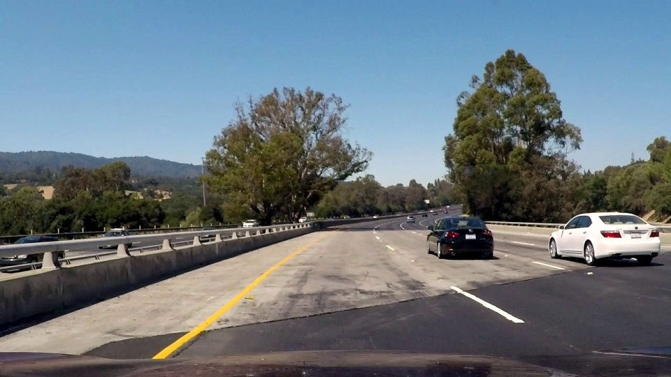

**Lane Finding Project**

The goals / steps of this project are the following:

* Compute the camera calibration matrix and distortion coefficients given a set of chessboard images.
* Apply a distortion correction to raw images.
* Use color transforms, gradients, etc., to create a thresholded binary image.
* Apply a perspective transform to rectify binary image ("birds-eye view").
* Detect lane pixels and fit to find the lane boundary.
* Determine the curvature of the lane and vehicle position with respect to center.
* Warp the detected lane boundaries back onto the original image.
* Output visual display of the lane boundaries and numerical estimation of lane curvature and vehicle position.

### Camera Calibration

In this step, the camera calibration is performed using chessboard images. Specifically:

1. **Chessboard Corners Detection:**

The findChessboardCorners function from OpenCV is used to detect the inner corners of a chessboard pattern in calibration images.
These detected corners represent the observed image points.

2. **Object Points Generation:**

A corresponding set of 3D points in the real world (assuming the chessboard lies flat on the z=0 plane) is generated. These are referred to as object points.

3. **Camera Matrix and Distortion Coefficients Calculation:**

The calibrateCamera function is used with the object points and image points. This computes the camera matrix and distortion coefficients, which correct lens distortion.

4. **Distortion Correction:**

Using the computed matrix and coefficients, images are undistorted with cv2.undistort, removing distortion and producing geometrically accurate images.


| Distorted  | Undistorted |
| ------------- | ------------- |
|    |   |

#### 2. Describe how (and identify where in your code) you used color transforms, gradients or other methods to create a thresholded binary image.  Provide an example of a binary image result.

To create a thresholded binary image, I applied a combination of grayscale conversion and gradient thresholding techniques. This process was implemented in the `create_binary_image` function, located in the `helper_functions.py` file.

1. **Grayscale Conversion**: 
   - The input image is first converted to grayscale using `cv2.cvtColor(image, cv2.COLOR_RGB2GRAY)`. This simplifies the image by removing color information, making it easier to analyze intensity gradients.

2. **Sobel Gradient Thresholding**:
   - The Sobel operator is applied in the x-direction using `cv2.Sobel(gray, cv2.CV_64F, 1, 0, ksize=3)`. This detects horizontal edges, which are essential for identifying lane lines.
   - The absolute values of the gradients are computed, and the result is scaled to an 8-bit range `[0, 255]`.
   - A binary threshold is applied: pixels with scaled gradients between 20 and 100 are set to `1`, while others are set to `0`. This highlights areas of the image with significant horizontal intensity changes.

The result is a binary image where lane lines are distinctly highlighted while the rest of the image is suppressed. An example of a binary images generated by this function can be seen in the `output/binary_*.jpg` file, created during the execution of the `main.py` script.

| Orginal  | Binary |
| ------------- | ------------- |
|    |   |

#### 3. Describe how (and identify where in your code) you performed a perspective transform and provide an example of a transformed image.

In the `perspective_transform` function, a perspective transformation was applied to convert the road's trapezoidal region in the original image into a top-down, bird's-eye view. This transformation simplifies lane detection by making the lane lines appear parallel and easier to analyze.

1. **Defining Source and Destination Points**:
   - The source (`src`) points identify the trapezoidal region in the original image that captures the lane lines.
     ```python
     src = np.float32([[175, image.shape[0]], [900, image.shape[0]], [550, 350], [425, 350]])
     ```
   - The destination (`dst`) points define a rectangular region in the bird's-eye view.
     ```python
     dst = np.float32([[200, image.shape[0]], [900, image.shape[0]], [900, 0], [200, 0]])
     ```

2. **Computing the Transformation Matrix**:
   - OpenCV's `cv2.getPerspectiveTransform` computes the transformation matrix to map the `src` points to the `dst` points.
     ```python
     matrix = cv2.getPerspectiveTransform(src, dst)
     ```

3. **Applying the Transformation**:
   - The binary image is warped using `cv2.warpPerspective` to obtain the top-down view.
     ```python
     warped = cv2.warpPerspective(binary_image, matrix, img_size)
     ```

4. **Inverse Transformation**:
   - An inverse transformation matrix is computed for projecting the detected lane lines back onto the original image.
     ```python
     inverse_matrix = cv2.getPerspectiveTransform(dst, src)
     ```

The function returns the warped binary image and the inverse matrix.
You can also set display_frame parameter to see boundaries for the transformations.

Below is an example of the result of the perspective transform, showing how the lane lines become parallel:

| Orginal  | Warped |
| ------------- | ------------- |
|    |   |


#### 4. Describe how (and identify where in your code) you identified lane-line pixels and fit their positions with a polynomial?

TODO: Add your text here!!!

#### 5. Describe how (and identify where in your code) you calculated the radius of curvature of the lane and the position of the vehicle with respect to center.

TODO: Add your text here!!!

#### 6. Provide an example image of your result plotted back down onto the road such that the lane area is identified clearly.

TODO: Add your text here!!!

### Pipeline (video)

#### 1. Provide a link to your final video output.  Your pipeline should perform reasonably well on the entire project video (wobbly lines are ok but no catastrophic failures that would cause the car to drive off the road!).

TODO: Add your text here!!!

### Discussion

#### 1. Briefly discuss any problems / issues you faced in your implementation of this project.  Where will your pipeline likely fail?  What could you do to make it more robust?

TODO: Add your text here!!!

